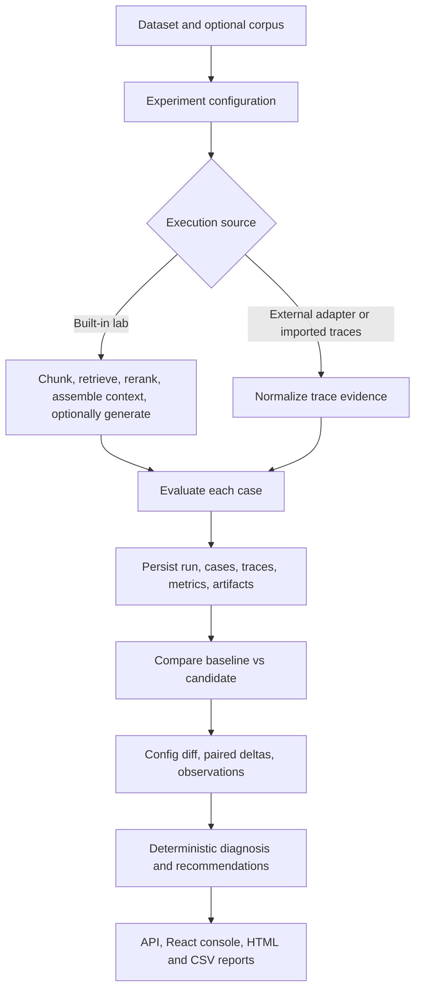

# Ragguage

Ragguage is a local control plane for evaluating RAG systems as versioned experiments instead of one-off prompts. It runs or imports RAG traces, scores them case by case, compares baseline and candidate runs, and preserves the evidence needed to explain regressions.

It is useful when a team needs to know not just whether a RAG change moved a metric, but where the movement appeared: retrieval, reranking, context assembly, generation, evaluation coverage, latency, or cost.

## Core Idea

Ragguage treats RAG evaluation as an evidence graph. Datasets, corpora, experiments, runs, traces, metrics, artifacts, comparisons, diagnoses, and recommendations are stored as immutable records, while platform and workspace configuration are versioned separately.

That makes it more than a basic RAG demo or LLM wrapper: the implemented path can compare two terminal runs, compute paired metric deltas, detect instrumentation/evidence loss, localize likely regression stages, and propose controlled follow-up experiments from the observed configuration diff.

## How It Works



## Key Capabilities

- Authenticated FastAPI control plane with users, sessions, role checks, health endpoints, and audit-backed configuration changes.
- Durable experiment execution queue with cancellation and explicit interrupted-job recovery that does not replay provider calls automatically.
- Built-in local pipeline lab with source-preserving chunking, dense pgvector retrieval, BM25 lexical retrieval, reciprocal rank fusion, optional reranking, context assembly, and optional OpenAI-compatible chat generation.
- Evaluation over built-in runs, external adapters, or imported normalized traces using deterministic retrieval metrics plus optional judge-backed quality metrics.
- Baseline/candidate comparison with paired deltas, bootstrap confidence intervals, quality-gate changes, operational observations, evidence references, and deterministic regression diagnosis.
- React/Vite console for datasets, experiments, jobs, comparisons, recommendations, settings, adapters, and models.

## Tech Stack

| Layer | Implemented with |
| --- | --- |
| Backend | Python 3.11+, FastAPI, Pydantic, SQLAlchemy, Uvicorn |
| Persistence | PostgreSQL, pgvector, Alembic migration files |
| RAG lab | sentence-transformers, pgvector, bm25s, optional cross-encoder reranking, httpx chat-completions calls |
| Evaluation | NumPy, deterministic ranking metrics, optional RAGAS/OpenAI/LangChain dependencies in the `lab` extra |
| Frontend | React 19, TypeScript, Vite, Tailwind CSS, Recharts, lucide-react |
| Testing | pytest, Ruff, Playwright |

## Repository Structure

| Path | Purpose |
| --- | --- |
| `src/` | Backend API, CLI, storage, worker, pipeline lab, evaluation, comparison, diagnosis, reports, and contracts. |
| `app/` | Current React/Vite web console and Playwright integration tests. |
| `tests/` | Python tests for API/storage, pipeline behavior, metrics, worker flow, analysis, and integrations. |
| `migrations/` | Alembic environment and foundation migration. |
| `app-old/` | Older UI snapshot kept in the repository; not used by the current quick start. |

## Quick Start

Prerequisites: Docker, Python 3.11+, `uv`, and Node.js/npm.

```powershell
$env:RAGGAUGE_POSTGRES_PASSWORD = "change-me-local-password"
docker compose up -d
uv sync --extra lab
uv run ragguage init
uv run ragguage create-admin
uv run ragguage serve
```

In a second terminal, start the durable worker:

```powershell
$env:RAGGAUGE_POSTGRES_PASSWORD = "change-me-local-password"
uv run ragguage worker
```

In a third terminal, start the web console:

```powershell
cd app
npm ci
npm run dev
```

Open `http://127.0.0.1:8501`. Vite proxies `/api` to `http://127.0.0.1:8000` by default; set `RAGGAUGE_API_PROXY_TARGET` before `npm run dev` if the API runs elsewhere.

For a no-database smoke artifact:

```powershell
uv run ragguage fixture
```

That command writes a fixture comparison HTML file and matching JSON without model calls.
